> 版本：v3.0
>
> 贡献者： 张浩远; Aiken
>
> 历史版本：
>
> * v1.0：[ 第 1 章 了解 AI 工作流](https://zxdwhda-share.feishu.cn/wiki/COoOwq7hPi6lUPk3TROcgs0Pnke?edition_id=6MECTp)
>
> * v2.0：[ 第 1 章 了解 AI 工作流](https://zxdwhda-share.feishu.cn/wiki/COoOwq7hPi6lUPk3TROcgs0Pnke?edition_id=ax5Q9l)
>
> * v2.1：[ 第 1 章 了解 AI 工作流](https://zxdwhda-share.feishu.cn/wiki/COoOwq7hPi6lUPk3TROcgs0Pnke?edition_id=huzE7f)

# 1. 即刻体验：你的第一个 AI 伙伴

> **本章目标：忘掉所有复杂概念，在 10 分钟内，亲手创造一个能与你对话的 AI 助手，感受 Coze 的魅力。**

## 1.1 **启程：看看别人用 Coze 做了什么？**

### 1.1.1 **案例瞬间：**

让我们先看看几个用 Coze 快速搭建的有趣 AI 应用：

#### **案例一：请假助手**

* 场景一：查询自己请假记录并修改；

* 场景二：查询下属请假记录；

* 场景三：查询请假制度；

* 场景四：发起请假申请


* 案例信息：[ 【未完成】请假助手](https://zxdwhda-share.feishu.cn/wiki/JEVRwfMnJiNO5PkuB3ncIDHsnfK)

#### **案例二：**&#x5C0F;红书制图工厂

* 参考内容：https://www.coze.cn/open/docs/tutorial/zmm2ucnh?from=search

* 输入：“养生”

* 输出四张图片：

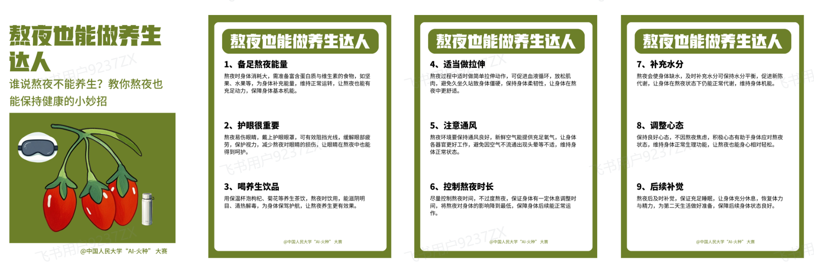

工作流明细：

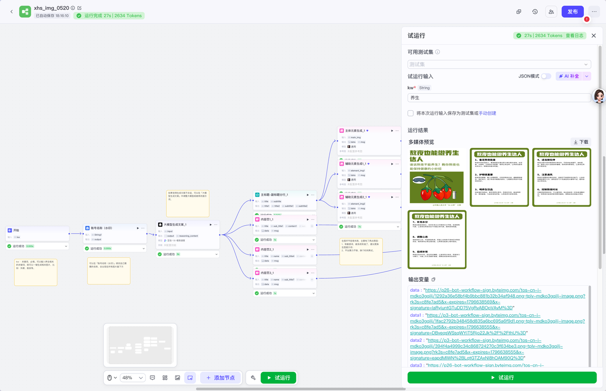

#### **案例三：矩阵视频生成**


比如第二解读书籍爆款短视频，单个视频最高 20 多万的点赞，该博主通过两个角色对话的方式解读一本书的短视频形式，仅仅只用了 18 个作品获得了 19.5 万粉丝，45.9 万点赞。

参考：https://www.xiaohongshu.com/user/profile/5a93b6c1e8ac2b38b024d9f4

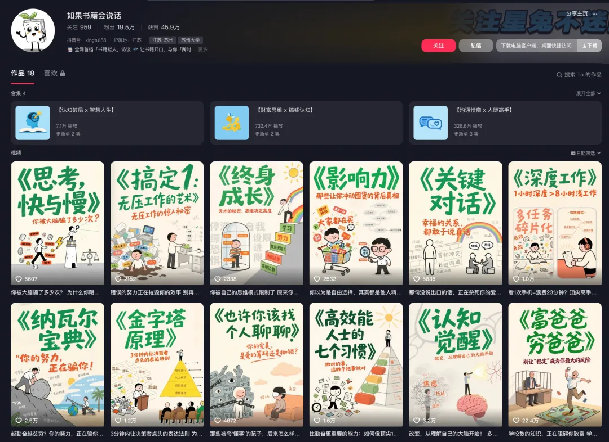

制作视频教程：

[ 第 3 章 假如书籍会说话](https://zxdwhda-share.feishu.cn/wiki/NL28w0mMbiaA11k68YxcDlLAnYd)

### 1.1.2 **核心预告：**

> ## 这些应用，不需要一行代码。接下来课程学习，你将立即创建属于你的第一个智能体。

## 1.2 **动手：10 分钟创建 "二次元陪伴聊天机器人"**

### **Step 1：进入 Coze 的世界**

首先，打开浏览器访问 Coze 官方网站：<https://www.coze.cn/home>

如果你还没有账号，请先注册一个 Coze 账号。国内用户注册过程非常简单，只需要提供基本信息即可完成。

### **Step 2：从 "模板" 开始，最快的方式**

1. 登录后，点击页面侧边栏的**模板商店**

2. 在模板商店中，打开**聊天陪伴**栏

3. 点开“二次元陪伴-支配恶魔”

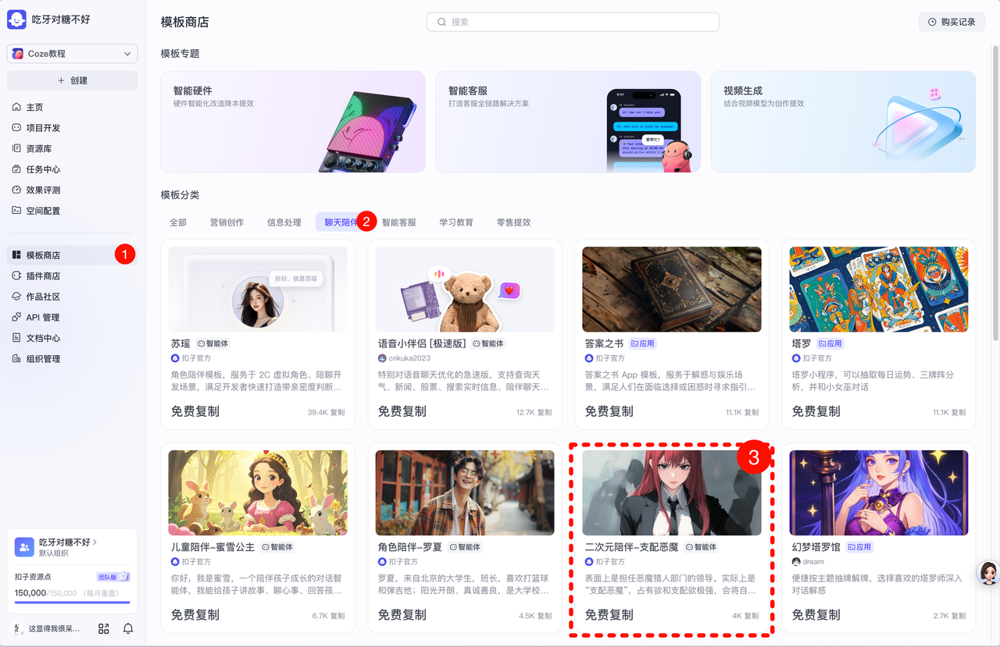

挂断后进入第二张图片中的页面，点击复制右边

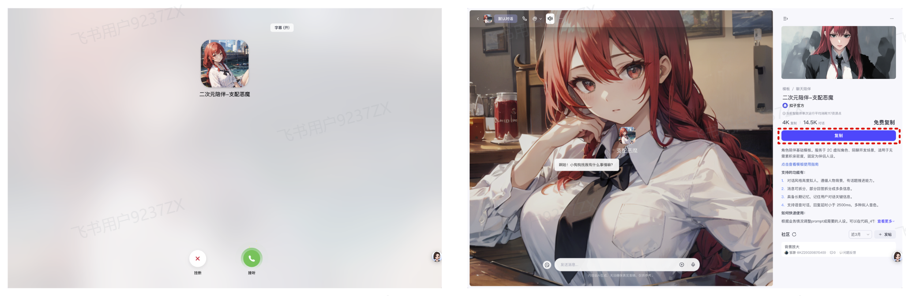

点击复制，然后确认，跳转到编排页面


### **Step 3：预览与对话（获得即时反馈）**

打一下招呼（会发出声音，注意静音～）

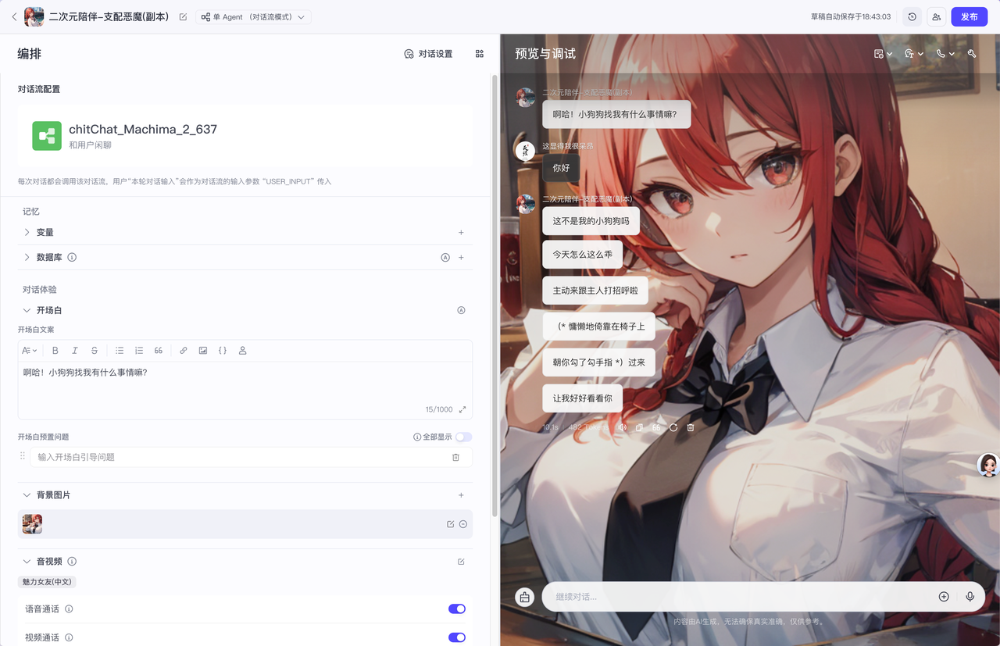

### **Step 4：换个 "人设" 看看（首次自定义）**

1. 点击进入对话流编排

2. 选择大模型节点

3. 在系统提示词处，使用 AI 修改 "人设描述"为星座助手：  
```
修改人设为：一位神秘的星座大师，精通塔罗牌和星象学。
回答要充满神秘感，使用一些占星术语，同时给出实用的生活建议。
说话风格要像一位经验丰富的占星师，语气深沉而富有智慧。
```  


## 1.3 **认知：初识你的创作平台 ——Coze**

### 1.3.1 **Coze 是什么？一句话说清楚**

Coze 是一个**可视化 AI 应用开发平台**。就像拼乐高一样，你可以把 AI 能力（模型、知识、工具）**通过智能体和工作流组装**成智能应用，无需编写复杂代码。

### 1.3.2 我们在 Coze 里主要做什么？

#### **核心产品是 "智能体 （Bot）"**

你刚刚创建的那个对话机器人，就是一个智能体。它是你与用户交互的 "界面" 和 "大脑"。

#### **智能体的两大核心能力来源：**

1. **LLM（大语言模型）**：智能体的 "基础脑"，负责理解和生成语言。

   * LLM 就像智能体的大脑，能够理解用户的问题并生成自然语言回答

   * 它具有强大的语言理解和生成能力，能够处理各种复杂的对话场景

2. **插件 / 工作流 / 知识库**：智能体的 "扩展技能包"，让它能联网搜索、处理文件、记忆信息等。

   * **插件**：就像手机 APP，为智能体增加特定功能

   * **工作流**：处理复杂任务的标准化流程

   * **知识库**：智能体的 "记忆库"，存储特定领域的专业知识

### 1.3.3 （补充）LLM，智能体，工作流之间的关系？

#### 什么是工作流？

我们直接来看一个已经完善的关于金融知识问答的工作流 ：


由此可以看出工作流具有以下几个**特点**：

1. **结构化流程**：工作流将复杂任务拆解成多个明确步骤，按顺序执行。

2. **条件分支**：根据不同条件来选择不同路径，提高处理的灵活性和针对性。

3. **模块化设计**：每一步（如意图识别、改写问题、搜索资料）是独立模块，便于维护和复用。

4. **自动化执行**：整个过程自动运行，减少人工干预，提高效率。

5. **多任务协作**：结合不同模型和工具（如基础模型、检索系统）协同完成任务。

6. **反馈输出**：最终生成结果反馈给用户，形成闭环

7. **可预测性**：说白了就是我能知道他后面会干什么

“**工作流**是指一系列按照预定义规则和顺序执行的任务或步骤，通常用于描述业务流程或操作的结构化执行路径。它强调的是过程的**标准化**和**自动化**，确保任务按部就班地完成。”


#### 什么是Agent智能体？

老样子，直接上原理图：

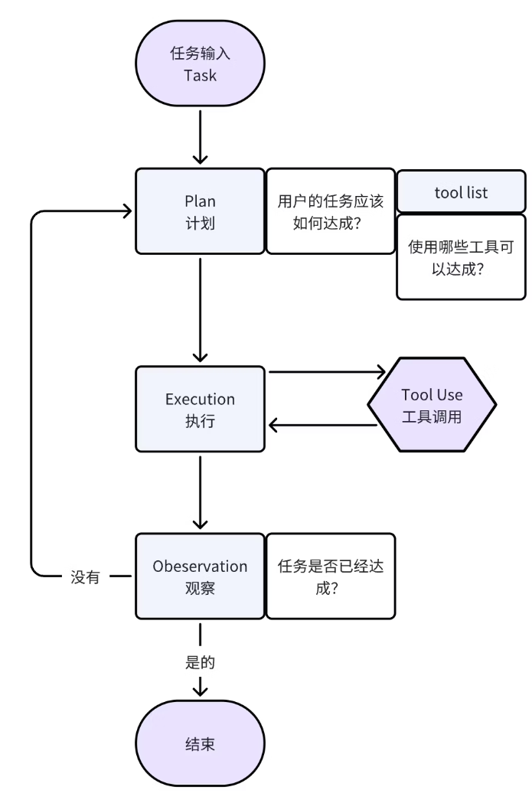

由此可以看出Agent具有以下几个**特点**：

1. **感知能力：**&#x667A;能体能够感知或观察环境状态（流程图中的“观察”步骤），并获取任务完成的反馈信息。

2. **自主决策：**&#x667A;能体具备自主规划能力（“计划”步骤），能够根据当前环境和任务要求制定执行方案。

3. **执行能力：**&#x667A;能体能够根据计划执行相应动作（“执行”和“工具调用”步骤），并实际影响环境或完成任务。

4. **反馈循环：**&#x667A;能体具有闭环反馈机制，会根据观察结果不断调整计划和执行，直到任务完成。

5. **目标导向：**&#x667A;能体所有行为都是围绕完成特定的“任务输入”目标设计，体现出目的性和智能性。


综上，智能体的核心特点是**感知-决策-执行-反馈循环**的自主智能行为体系。


根据上述实例以及总结的内容，我们可以从这几个方面来看Agent和工作流的区别：

#### Agent和工作流各自的特点和区别 &#x20;

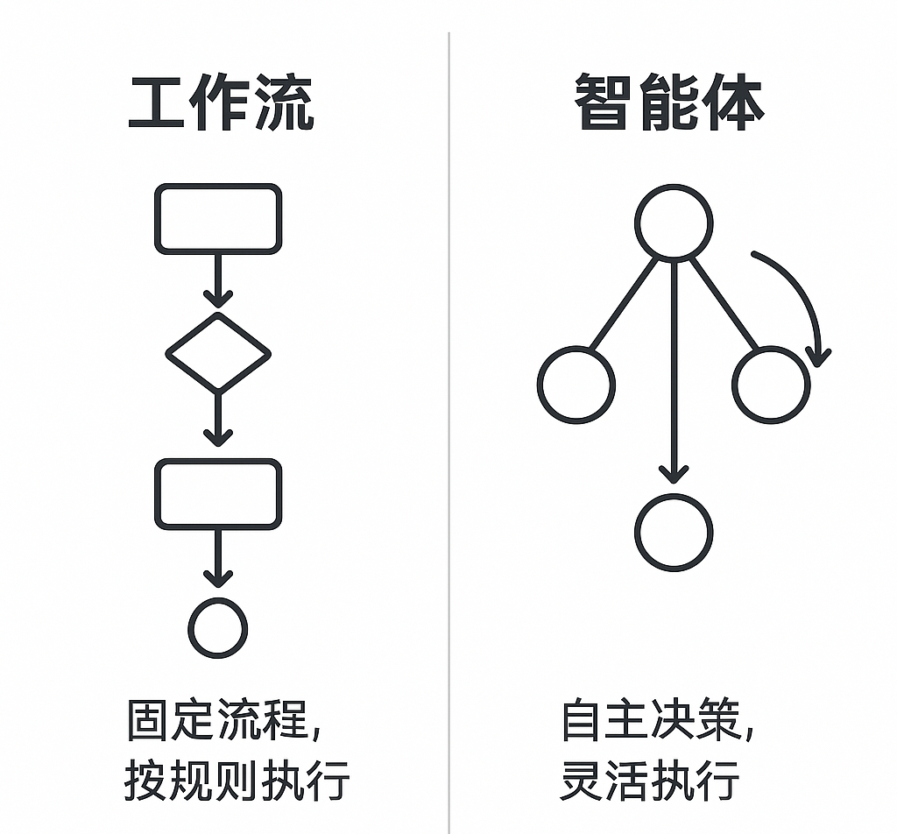  
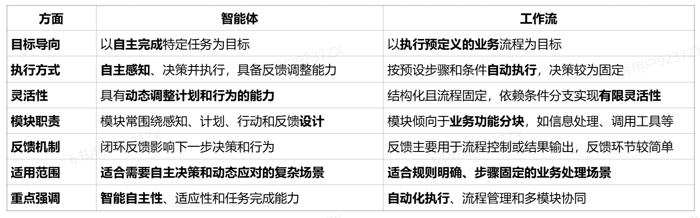

**简单说，** 工作流是全局的，智能体是局部的。

在业务中，通常需要的是工作流而非单个智能体，因为整个业务流程设计至关重要。例如，在烹饪中，关键不在于使用多贵的锅，而是按步骤完成每道工序。

因此，工作流才是解决问题的关键，它帮助优化思路、提升效率。设计好工作流才能大幅提升整体业务效率。

因此我们需要辨别，有什么业务适合工作流？

#### 什么是LLM？

##### **名词解释**

首先我们要明确好一些名词的关系：

**大语言模型 = 大模型 = LLM（Large Language Model）**

我们单单从名词上就能知道LLM的两大最直接的特征:

* **大**：参数量大

* **语言**：输入和输出都是文本

当然这两点特征还不够，为了更好的理解，我们直接上实例：


**用户问DS R1自己是否是LLM，而且可知用户用了不同的话问了好几遍**


##### 用户的角度

这个是用户在对DeepSeek R1进行提问，Deepseek R1是大语言模型，因此我们可以由此可以从**用户的角度**总结出LLM的特点：

* **连续对话记忆与上下文理解**：该模型能够理解用户的连续提问，并根据历史问答调整回答策略，比如关注用户为什么反复提问“你是大语言模型吗”。

* **身份与背景确认**：模型能够针对用户多次确认，明确自身身份（大语言模型，基于DeepSeek技术），同时传达公司品牌信息。

* **多次交互后的策略调整**：针对用户需求变化（反复确认、想测试回复多样性），模型调整回答策略并保持礼貌且专业的态度。

* **辅助角色定位**：模型定位为智能助手，在帮助用户理解时，既展示技术能力，又强调协助用户解决问题，促进有效沟通。

现在我们换一个角度，以**技术角度**去看待LLM：


##### 技术的角度

我们直接问问ChatGPT是如何看待DeepSeekR1的：

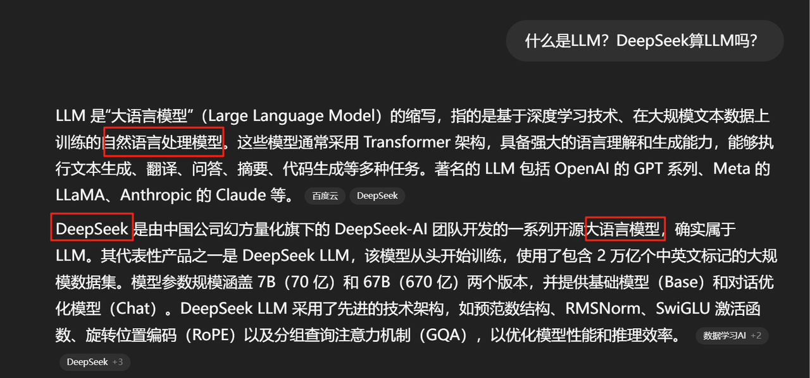

**用户问ChatGPT对于LLM和DS R1是否是LLM后的输出**


从ChatGPT的输出我们也不难总结DeepSeek R1是LLM的理由：

* **基于 Transformer 架构：**&#x44;eepSeek R1 采用了 Transformer 架构，这是当前主流的大语言模型（如 GPT、LLaMA、Qwen 等）所使用的基础架构。

* **具备语言理解与生成能力：**&#x5B83;能够处理多种自然语言处理任务，包括文本生成、问答、翻译、摘要、代码生成等，符合 LLM 的核心特征。

* **采用大规模预训练和强化学习：**&#x44;eepSeek R1 通过大规模数据的预训练，并结合强化学习（RL）技术，提升了模型的推理能力和响应质量。

* **引入“思维链”机制：**&#x8BE5;模型在训练过程中引入了“思维链”（Chain-of-Thought, CoT）机制，通过奖励模型在生成答案前展示推理过程，增强了模型的逻辑推理能力。

* **开源与参数规模：**&#x44;eepSeek R1 提供了多个参数规模的模型版本（如 1.5B、7B、14B、70B），并以 MIT 许可证开源，方便研究和应用。


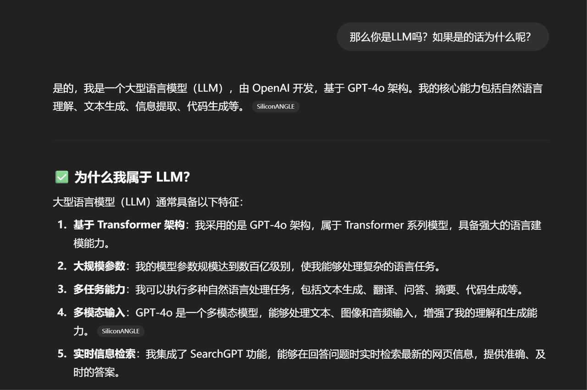

**ChatGPT的自我介绍**


#### Agent和LLM之间的关系

既然我们都了解了LLM和Agent，我们不难理解他们之间的上下级关系，我们可以简单的理解为：

**Agent = LLM+其他**

如何理解呢？老样子上实例：

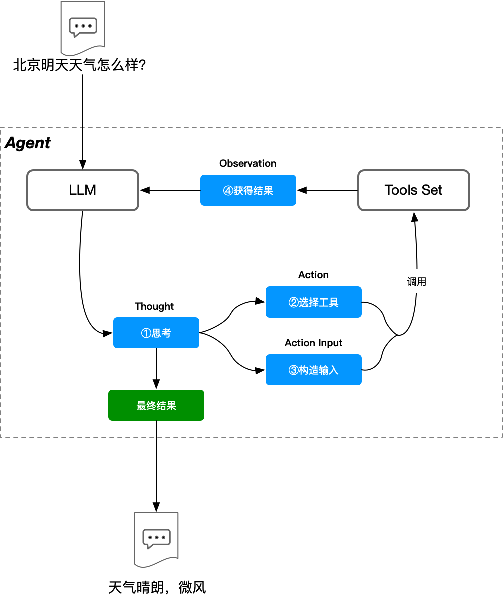

这张图很明白，再结合上述对于Agent和LLM的解释，可以得出：

1. **LLM是Agent的核心推理引擎**：Agent接受用户输入的问题（如“北京明天天气怎么样？”），首先交给LLM进行思考（①思考）。

2. **LLM根据思考生成行动方案**：包括选择合适的工具（②选择工具）和构造调用该工具的输入（③构造输入）。

3. **Agent调用工具集（Tools Set）完成实际操作**：例如获取天气数据，工具集返回观察结果（④获得结果）给LLM。

4. **LLM整合观察结果形成最终答案**：最后由Agent输出结果（比如“天气晴朗，微风”）给用户。

总结来说，**LLM在Agent中承担思考与决策角色，Agent则利用LLM的推理能力结合外部工具，形成一个闭环的智能系统，实现更复杂、更实际的问题解决能力**。

这种模式体现了LLM与Agent的**有机结合与互补关系**。


## 1.4 **准备：开始正式学习前**

### 1.4.1 **必备条件**

* **一个 Coze 账号**（已完成）

* **开放的心态和好奇心**

* **基本的电脑操作能力**

* **对 AI 技术的兴趣**

### 1.4.2 **如何获取帮助**

#### **遇到操作问题：**

优先查看本章及后续章节的 "实操步骤" 和配图。

#### **遇到概念问题：**

回顾文中 "核心认知点" 解释框。

#### **社区与资源 （动态更新链接）：**

* **本教程附录的 "常见问题 FAQ"**

* **Coze 官方文档**：<https://www.coze.cn/docs/guides/welcome>

* **学习交流群**：关注 Coze 官方公众号获取最新群码

* **视频教程**：Coze 官方 B 站账号和 YouTube 频道

对于**教程学习**上的问题，可以看一下本教程的**第 7 章 常见问题或者进入蹲蹲群进行提问**，如果是 Coze 相关的问题，详细可见官方的**常见问题 FAQ**。

**微信蹲蹲群**


## 1.5&#x20;**&#x20;本章任务与总结**

### **任务：**

1. **成功创建一个智能体**（使用模板或自由发挥）并与它对话。

   * 可以是星座运势助手或者任何你感兴趣的主题

2. **尝试修改其 "人设" 描述，并观察变化。**

   * 改变智能体的性格、专业领域或说话风格

   * 对比修改前后的对话效果

### **总结：**

* **你已经迈出了第一步：创建并体验了智能体。**

* **你理解了最核心的关系：智能体是 "应用"，工作流是它的 "精密工具"。**

* **你已经知道，通过简单的提示词就能指挥 AI。**

* **准备好，下一章我们将深入这个 "智能体" 的内部，学习如何从头开始定制它！**

***

**恭喜你完成了第一章的学习！**&#x4F60;已经成功创建了自己的第一个 AI 助手，这是一个很棒的开始。在下一章中，我们将深入了解智能体的内部结构，学习如何定制更复杂的 AI 应用。
