> 版本：v3.0
>
> 贡献者：张浩远，空飞，Aiken
>
> 历史版本：
>

# 4. 工作流**的基本功**

> #### **致学习者：**
>
> 有过搭建经验的小伙伴，可以快速过一遍本章内容，然后去认真完成第6章的进阶部分；第一次接触 Coze 或者工作流的朋友，请务必好好跟着实操一遍。工作流的“增、删、改、查”是基本中的基本，学再多的技巧也没有用！
>
> **练好基本功，方可前行万里！**

## 4.1 前言

欢迎来到 Coze 工作流的实战起点。在之前的章节里，我们认识了智能体的概念，而从本章开始，我们将亲手搭建，让它从概念变为你手中解决实际问题的利器。

为了让大家建立一个清晰、扎实的学习路径，本教程将工作流的学习拆解为三个循序渐进的阶段，它们共同构成了一位 AI 应用构建者能力成长的完整拼图：

### 4.1.1 **搭建与调试：工作流的基本功**

**搭建与调试**是工作流的基本功。它关注的是 "**如何建造**"—— 如何创建节点、连接线路、配置参数、调试运行。这是我们与 Coze 工作流编辑器交互的基本操作，是一切复杂构思得以实现的基石。无论你此前是否有过搭建经验，请务必重视这部分内容。**熟练掌握这些基本功，是将想法转化为现实的第一步，也是你后续一切创意和效率提升的前提。**

### 4.1.2 **流程与模式：工作流的设计思维**

这是第 6 章“**流程与模式**”将要深入的核心。当我们熟悉了工具的使用后，需要建立的是 **"如何设计"** 的思维。我们将跳出单个节点的局限，学习几种普适性的工作流设计模式（如链式、路由式、评估优化式、并行式）。这些模式是构建复杂应用的 **"设计蓝图"** 和 **"核心框架"**。掌握它们，你将能举一反三，从容应对各种自动化场景。

### 4.1.3 **组件与集成：工作流的赋能生态**

当框架搭建好后，我们需要用丰富的 "官能" 为其注入智能。**知识库、插件、代码节点、大模型**等官方组件，就如同这个框架中功能各异的专业模块。理解数据如何在它们之间高效流动与转化，就是学习如何为你的工作流赋予更强大的能力，使其真正成为一个能听、会看、懂思考、善行动的智能体。

通过这样的结构，我们希望能引导你实现一次视角的升华：**Coze 平台本身将逐渐 "隐形"，因为它只是一个实现思想的优秀工具。真正重要的，是贯穿所有自动化流程的底层逻辑 —— 扎实的基本操作、清晰的设计模式与灵活的数据集成能力。**

最终，本教程的目标不仅仅是让你成为一个熟练的 Coze 用户，更希望你成为一名具备 **AI 工作流思维** 的设计师。无论未来面对何种平台，你都能运用这套方法论，去构建属于你自己的智能解决方案。

现在，让我们从最核心的基本功开始，一起点亮 Coze 工作流的搭建技能。

## 4.2 什么是工作流

Coze 工作流支持通过可视化的方式，对插件、大语言模型、代码块等功能模块进行组合，从而实现复杂、稳定的业务流程编排。当目标任务场景包含较多的步骤，且对输出结果的准确性、格式有严格要求时，适合配置工作流来实现。

### 4.2.1 和 Coze 智能体的区别

在深入理解工作流之后，一个核心的问题是：**工作流与我们在 Coze 平台上构建的 "智能体" 是什么关系？**&#x7B80;单来说，它们是 "部分" 与 "整体"、"工具" 与 "大脑" 的关系。

#### 4.2.1.1 **核心定位：组件与中枢**

* **工作流：是一个功能 "组件" 或 "工具链"。**&#x5B83;是一系列预设步骤的自动化流程，专注于**高效、稳定地完成一个特定任务**。正如前一节所探讨的，无论是生成报告还是处理图片，工作流都像一个高度专业化的流水线，输入明确指令，输出预期结果。它强大而精准，但本身不具备 "意图" 或 "目标"。

* **智能体：是整个系统的 "大脑" 和 "中枢"。**&#x667A;能体是一个具备认知、决策和行动能力的 AI 实体。在 Coze 中，你构建的智能体是一个完整的、可交互的 AI 应用。它拥有身份设定、知识库、长期记忆、对话能力，并能够**自主判断何时以及如何调用各种工具（包括工作流）来达成用户的目标**。

#### 4.2.1.2 **角色类比：专业团队与公司 CEO**

一个生动的类比可以帮助我们理解：

* **工作流**就像公司里的一个个**专业部门或自动化生产线**。

  * 例如，"财务报销工作流" 自动处理发票校验与录入；"海报生成工作流" 按固定步骤产出设计图。它们各司其职，专业高效，但只响应明确的指令。

* **智能体**则像是公司的**CEO 或总指挥官**。

  * 它不亲自去做财务校验或平面设计，但它拥有公司的整体战略（**身份设定**）、了解公司的内部资料（**知识库**）、记得与客户的过往交谈（**记忆**）。当用户（如员工）提出一个复杂需求（例如："帮我策划并执行一次新产品推广"）时，这位 "CEO" 会：

    1. **理解意图**：通过对话与分析，理解用户想要的是市场推广。

    2. **制定规划**：将大任务分解为市场调研、内容创作、渠道发布等子任务。

    3. **调度资源**：**指挥并调用**相应的工作流和工具 —— 让 "市场调研工作流" 生成报告，让 "内容生成工作流" 创作文案和海报，最后让 "发布工具" 将内容同步到各平台。

    4. **整合交付**：将各个组件的结果汇总，形成一个完整的推广方案并回复给用户。

在这个过程中，**工作流是被智能体调用的 "四肢" 和 "工具"，而智能体是进行思考、规划和决策的 "大脑"**。

#### 4.2.1.3 **技术架构：执行层与代理层**

> 参考：[ Inhai: Agentic Workflow：AI 重塑了我的工作流](https://waytoagi.feishu.cn/wiki/MhC0wBXyBiDB8DkR0L5c6P7Pn1g?from=from_copylink)

参考 Lilian Weng 提出的 Agent 框架（Agent = LLM + 规划 + 记忆 + 工具使用），我们可以更清晰地看到两者的位置：

* **工作流**主要实现了框架中的 **"工具使用"** 部分。它将多个工具（插件、大模型、代码等）通过逻辑编排串联起来，形成一个更强大的复合工具。

* **智能体**则涵盖了**完整的 Agent 框架**：

  * **LLM（大模型）**：作为智能体的核心 "大脑"，处理语言理解与生成。

  * **规划**：智能体能够分解复杂任务（对应吴恩达提出的 Planning 模式）。

  * **记忆**：智能体拥有短期对话记忆和长期知识存储与检索的能力。

  * **工具使用**：**调用工作流，正是智能体实现工具使用的最高效方式之一**。此外，它还能直接调用单一步骤的插件、API 等。

因此，在 Coze 平台中，**智能体通过集成 "工作流" 这一强大组件，极大地扩展了其解决复杂问题的能力和可靠性**。

#### 4.2.1.4 **使用场景：确定性与不确定性**

* **使用工作流**：当任务**步骤固定、逻辑明确、追求稳定性和可重复性**时。例如，每日自动生成新闻摘要、每张上传图片自动添加水印和元数据。

* **使用智能体**：当面对**开放、复杂、需要多轮交互和上下文理解**的任务时。例如，一个担任智能客服的智能体，它需要先理解用户情绪和问题，再查询知识库，可能需要多次追问细节，最后或许会调用一个 "退货申请工作流" 来完成具体操作

#### 4.2.1.5 **总结**

简单来说，你构建一个工作流，是为了让智能体 "调用"；而你构建一个智能体，是为了给用户提供一个完整的、能思考会行动的 "AI 伙伴"。工作流让智能体的 "行动" 更可控、更强大，而智能体则为工作流赋予了 "智慧" 和 "灵魂"，使其能够应对真实世界中复杂多变的需求。

### 4.2.2 和对话流的区别

#### 4.2.2.1 核心概念提炼

* **工作流：程序驱动，一步到位。**

  * **特点**：线性、自动、无需用户中途参与。你输入初始指令，它就像运行一个程序，内部默默执行所有步骤，最后给你一个完整的结果。

  * **核心**：数据处理与自动化

* **对话流：用户驱动，步步为营。**

  * **特点**：非线性、交互式、有状态。它通过多轮问答，逐步从用户那里收集信息，并根据用户的回答决定下一步做什么。

  * **核心**：信息收集与流程导航

#### 4.2.2.2 案例讲解

**工作流 —— "全自动智能报销系统"**

想象一下，公司有一个**全自动的报销流水线**（工作流）。你只需要在 App 里拍一下发票照片并提交，剩下的全部自动完成：

1. **发票识别**：自动读取发票上的金额、日期、类型。

2. **规则校验**：根据公司政策，自动判断发票类型是否合规、金额是否超标。

3. **数据录入**：自动将合规的报销单信息填入财务系统。

4. **通知结果**：自动给你发消息："报销已通过，金额 XX 元，预计 3 天内到账" 或 "报销被驳回，原因：发票类型不符"。

**整个过程你不需要和系统对话**，它自动跑完所有流程，给你一个最终结果。这非常适合**规则明确、步骤固定的任务**。

**对话流 —— "智能订餐助手"**

现在，想象一个**奶茶店的微信小程序助手**（对话流）。你想点一杯奶茶：

这个过程中，**助手通过和你一轮轮的对话，逐步收集齐了 "饮品类型"、"具体品类"、"甜度"、"冰度" 和 "确认信息"**。它就像一个聪明的服务员，根据你的上一个回答，来决定下一个该问什么问题，并最终完成一个复杂的任务（下单）。

**为了更清晰，可以提供一个简单的对比：**

> ## 各位大佬，这里请留步，下面的内容请查看目录后确认是否实操！！！
>
> ## 如果你的能力足够建议前往第 6 章！

## 4.3 创建工作流

### 4.3.1 在个人空间创建工作流

1. 登录[扣子平台](https://www.coze.cn/)。

2. 在左侧导航栏中选择**工作空间**，并在页面顶部空间列表中选择个人空间。

（注意：系统默认创建了一个个人空间，该空间内创建的资源例如智能体、插件、知识库是你的私有资源，其        他用户不可见。你也可以创建团队或加入其他团队，团队内的资源可以和其他团队成员共享。）

* 在**资源库**页面右上角单击 **+资源**，并选择**工作流**。

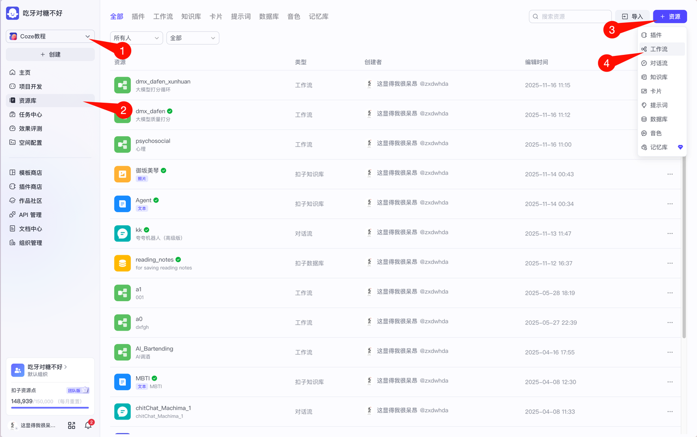

* 设置工作流的名称与描述，并单击**确认。**

&#x20;（注意：清晰明确的工作流名称和描述，有助于大语言模型更好的理解工作流的功能。）

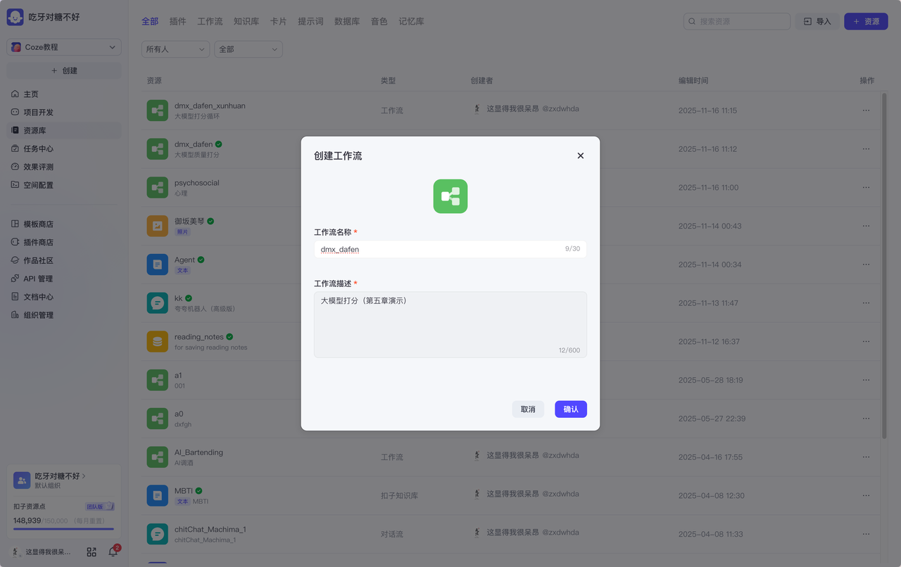

* 创建后页面会自动跳转至工作流的编辑页面，初始状态下工作流包含**开始**节点和**结束**节点。

&#x20;   （注意：**开始**节点用于启动工作流，**结束**节点用于返回工作流的运行结果。）


### 4.3.2 使用模板创建工作流

> 搭建顺便选择一个模板体验一下即可

1. &#x20;在左侧导航栏中选择**模版**，在右侧栏里依据需要选择主题，接着选择想要的工作流模板，点击进入该工作流界面。

2. 如果是收费的，可以在试运行后，点击**购买**，在线支付，如果是免费的就直接点击**复制**，依据需要可选择复制添加至智能体或空间。之后的修改也可以去**工作空间**中的**资源库**界面打开。

   

   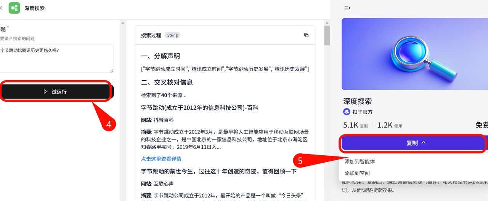


### 4.3.3 创建工作流副本

#### 4.3.3.1 跨画布复制节点

打开我们 5.3.1 创建的` dmx_dafen`工作流页面

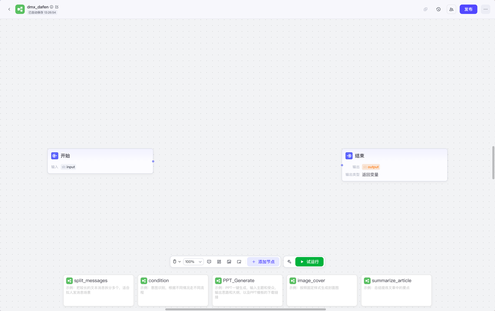

复制工作流配置文件，点击 "画布" 空白处，按下快捷键 Ctrl+V，完成复制。（飞书版本点击右侧即可复制）

```json
{"type":"coze-workflow-clipboard-data","source":{"workflowId":"7571359867802533903","flowMode":0,"spaceId":"7434033847194828826","isDouyin":false,"host":"www.coze.cn"},"json":{"nodes":[{"id":"100001","type":"1","meta":{"position":{"x":640,"y":-154.65851209038328}},"data":{"nodeMeta":{"description":"工作流的起始节点，用于设定启动工作流需要的信息","icon":"https://lf3-static.bytednsdoc.com/obj/eden-cn/dvsmryvd_avi_dvsm/ljhwZthlaukjlkulzlp/icon/icon-Start-v2.jpg","subTitle":"","title":"开始"},"outputs":[{"type":"string","assistType":1,"name":"url","required":false}],"trigger_parameters":[]},"_temp":{"bounds":{"x":460,"y":-154.65851209038328,"width":360,"height":86},"externalData":{"icon":"https://lf3-static.bytednsdoc.com/obj/eden-cn/dvsmryvd_avi_dvsm/ljhwZthlaukjlkulzlp/icon/icon-Start-v2.jpg","description":"工作流的起始节点，用于设定启动工作流需要的信息","title":"开始","mainColor":"#5C62FF"}}},{"id":"900001","type":"2","meta":{"position":{"x":2214.0912323277203,"y":-141.65851209038328}},"data":{"nodeMeta":{"description":"工作流的最终节点，用于返回工作流运行后的结果信息","icon":"https://lf3-static.bytednsdoc.com/obj/eden-cn/dvsmryvd_avi_dvsm/ljhwZthlaukjlkulzlp/icon/icon-End-v2.jpg","subTitle":"","title":"结束"},"inputs":{"terminatePlan":"useAnswerContent","streamingOutput":false,"inputParameters":[{"name":"output","input":{"type":"float","value":{"type":"ref","content":{"source":"block-output","blockID":"173578","name":"average"},"rawMeta":{"type":4}}}}],"content":{"type":"string","value":{"type":"literal","content":"本次的模型输出的简洁性平均分数为{{output}}"}}}},"_temp":{"bounds":{"x":2034.0912323277203,"y":-141.65851209038328,"width":360,"height":112},"externalData":{"icon":"https://lf3-static.bytednsdoc.com/obj/eden-cn/dvsmryvd_avi_dvsm/ljhwZthlaukjlkulzlp/icon/icon-End-v2.jpg","description":"工作流的最终节点，用于返回工作流运行后的结果信息","title":"结束","mainColor":"#5C62FF"}}},{"id":"140819","type":"4","meta":{"position":{"x":640,"y":13}},"data":{"nodeMeta":{"description":"解析xlsx格式的文件，返回解析后的结果，格式为json","icon":"https://lf3-static.bytednsdoc.com/obj/eden-cn/dvsmryvd_avi_dvsm/ljhwZthlaukjlkulzlp/icon/icon-Plugin-v2.jpg","subtitle":"文档读取:xlsx_parse","title":"xlsx文件读取"},"inputs":{"apiParam":[{"input":{"type":"string","value":{"content":"7390591504273702952","rawMeta":{"type":1},"type":"literal"}},"name":"apiID"},{"input":{"type":"string","value":{"content":"xlsx_parse","rawMeta":{"type":1},"type":"literal"}},"name":"apiName"},{"input":{"type":"string","value":{"content":"7390591504273637416","rawMeta":{"type":1},"type":"literal"}},"name":"pluginID"},{"input":{"type":"string","value":{"content":"文档读取","rawMeta":{"type":1},"type":"literal"}},"name":"pluginName"},{"input":{"type":"string","value":{"content":"","rawMeta":{"type":1},"type":"literal"}},"name":"pluginVersion"},{"input":{"type":"string","value":{"content":"","rawMeta":{"type":1},"type":"literal"}},"name":"tips"},{"input":{"type":"string","value":{"content":"","rawMeta":{"type":1},"type":"literal"}},"name":"outDocLink"}],"inputParameters":[{"name":"url","input":{"type":"string","value":{"type":"ref","content":{"source":"block-output","blockID":"100001","name":"url"},"rawMeta":{"type":1}}}}],"settingOnError":{"processType":1,"timeoutMs":180000,"retryTimes":0}},"outputs":[{"type":"string","name":"message","required":true,"description":"解析后的excel源数据"}]},"_temp":{"bounds":{"x":460,"y":13,"width":360,"height":112},"externalData":{"icon":"https://lf3-appstore-sign.oceancloudapi.com/ocean-cloud-tos/plugin_icon/4215999067853865_1720690536784202029_vXnZVoO27C.png?lk3s=cd508e2b&x-expires=1765854046&x-signature=WKEMFDFEsO1ZX4GVJgvRFF6bVzc%3D","apiName":"xlsx_parse","pluginID":"7390591504273637416","pluginProductStatus":1,"pluginProductUnlistType":0,"pluginType":1,"spaceID":"7339861295488843776","inputs":[{"description":"excel的链接","input":{},"name":"url","required":true,"type":"string"}],"outputs":[{"description":"解析后的excel源数据","input":{},"name":"message","required":true,"type":"string"}],"updateTime":1763222839,"channel_id":2,"commercial_setting":{},"latestVersionTs":"0","latestVersionName":"","versionName":"","description":"解析xlsx格式的文件，返回解析后的结果，格式为json","title":"xlsx_parse","mainColor":"#CA61FF"}}},{"id":"188384","type":"5","meta":{"position":{"x":640,"y":183.12436329942162}},"data":{"nodeMeta":{"description":"编写代码，处理输入变量来生成返回值","icon":"https://lf3-static.bytednsdoc.com/obj/eden-cn/dvsmryvd_avi_dvsm/ljhwZthlaukjlkulzlp/icon/icon-Code-v2.jpg","mainColor":"#00B2B2","subTitle":"代码","title":"格式化"},"inputs":{"inputParameters":[{"name":"input","input":{"type":"string","value":{"type":"ref","content":{"source":"block-output","blockID":"140819","name":"message"},"rawMeta":{"type":1}}}}],"code":"async function main({ params }: Args): Promise<Output> {\n    try {\n        // 解析输入的JSON字符串\n        const dataArray = JSON.parse(params.input);\n        \n        // 提取所有的input和output\n        const inputs = dataArray.map(item => item.input);\n        const outputs = dataArray.map(item => item.output);\n        \n        // 构建输出对象\n        const ret = {\n            \"input\": inputs,\n            \"output\": outputs\n        };\n        \n        return ret;\n    } catch (error) {\n        // 错误处理\n        console.error(\"处理数据时出错:\", error);\n        throw error;\n    }\n}","language":5,"settingOnError":{"processType":1,"timeoutMs":60000,"retryTimes":0}},"outputs":[{"type":"list","name":"input","schema":{"type":"string"}},{"type":"list","name":"output","schema":{"type":"string"}}],"version":"v2"},"_temp":{"bounds":{"x":460,"y":183.12436329942162,"width":360,"height":112},"externalData":{"icon":"https://lf3-static.bytednsdoc.com/obj/eden-cn/dvsmryvd_avi_dvsm/ljhwZthlaukjlkulzlp/icon/icon-Code-v2.jpg","description":"编写代码，处理输入变量来生成返回值","title":"代码","mainColor":"#00B2B2"}}},{"id":"146231","type":"21","meta":{"position":{"x":1177.43838978044,"y":-167.65851209038328},"canvasPosition":{"x":997.43838978044,"y":208.01674391011494}},"data":{"inputs":{"inputParameters":[{"name":"input","input":{"type":"list","schema":{"type":"string"},"value":{"type":"ref","content":{"source":"block-output","blockID":"188384","name":"input"},"rawMeta":{"type":99}}}},{"name":"output","input":{"type":"list","schema":{"type":"string"},"value":{"type":"ref","content":{"source":"block-output","blockID":"188384","name":"output"},"rawMeta":{"type":99}}}}],"loopCount":{"type":"integer","value":{"type":"literal","content":10,"rawMeta":{"type":2}}},"loopType":"array","variableParameters":[]},"nodeMeta":{"description":"用于通过设定循环次数和逻辑，重复执行一系列任务","icon":"https://lf3-static.bytednsdoc.com/obj/eden-cn/dvsmryvd_avi_dvsm/ljhwZthlaukjlkulzlp/icon/icon-Loop-v2.jpg","mainColor":"#00B2B2","subTitle":"循环","title":"循环"},"outputs":[{"name":"output","input":{"type":"list","schema":{"type":"float"},"value":{"type":"ref","content":{"source":"block-output","blockID":"128931","name":"score"},"rawMeta":{"type":4}}}}]},"blocks":[{"id":"128931","type":"3","meta":{"position":{"x":180,"y":0}},"data":{"nodeMeta":{"description":"调用大语言模型,使用变量和提示词生成回复","icon":"https://lf3-static.bytednsdoc.com/obj/eden-cn/dvsmryvd_avi_dvsm/ljhwZthlaukjlkulzlp/icon/icon-LLM-v2.jpg","subTitle":"大模型","title":"数据标注员"},"inputs":{"inputParameters":[{"name":"input","input":{"type":"string","value":{"type":"ref","content":{"source":"block-output","blockID":"146231","name":"input"},"rawMeta":{"type":1}}}},{"name":"output","input":{"type":"string","value":{"type":"ref","content":{"source":"block-output","blockID":"146231","name":"output"},"rawMeta":{"type":1}}}}],"llmParam":[{"name":"modelType","input":{"type":"integer","value":{"type":"literal","content":"1737521813","rawMeta":{"type":2}}}},{"name":"modleName","input":{"type":"string","value":{"type":"literal","content":"豆包·1.5·Pro·32k","rawMeta":{"type":1}}}},{"name":"generationDiversity","input":{"type":"string","value":{"type":"literal","content":"balance","rawMeta":{"type":1}}}},{"name":"temperature","input":{"type":"float","value":{"type":"literal","content":"0.8","rawMeta":{"type":4}}}},{"name":"maxTokens","input":{"type":"integer","value":{"type":"literal","content":"4096","rawMeta":{"type":2}}}},{"name":"spCurrentTime","input":{"type":"boolean","value":{"type":"literal","content":false,"rawMeta":{"type":3}}}},{"name":"spAntiLeak","input":{"type":"boolean","value":{"type":"literal","content":false,"rawMeta":{"type":3}}}},{"name":"prefixCache","input":{"type":"boolean","value":{"type":"literal","content":false,"rawMeta":{"type":3}}}},{"name":"responseFormat","input":{"type":"integer","value":{"type":"literal","content":"2","rawMeta":{"type":2}}}},{"name":"prompt","input":{"type":"string","value":{"type":"literal","content":"<输入>\n{{input}}\n</输入>\n\n<输出>\n{{output}}\n</输出>","rawMeta":{"type":1}}}},{"name":"enableChatHistory","input":{"type":"boolean","value":{"type":"literal","content":false,"rawMeta":{"type":3}}}},{"name":"chatHistoryRound","input":{"type":"integer","value":{"type":"literal","content":"3","rawMeta":{"type":2}}}},{"name":"systemPrompt","input":{"type":"string","value":{"type":"literal","content":"您是一位专业的数据标注员，负责评估模型输出的简洁性。您的任务是根据以下评分标准给出评分：\n<评分标准>\n  完美简洁的答案应当：\n  - 仅包含被请求的确切信息。\n  - 使用最少的词汇来传达完整的答案。\n  - 省略客套话、模棱两可的表述和不必要的背景信息。\n  - 不包含关于答案或模型能力的元评论。\n  - 避免冗余信息或重复表述。\n  - 除非明确要求，否则不包含解释内容。\n\n  在打分时，您应该扣除分数的情况有：\n  - 诸如“我认为”“我觉得”或“答案是”之类的引导性短语。\n  - 像“可能”“大概”或“据我所知”这样的模糊表述。\n  - 不必要的背景或上下文信息。\n  - 未被要求的解释内容。\n  - 跟进问题或提供更多信息的提议。\n  - 冗余信息或重复表述。\n  - 像“希望这有帮助”或“如果您还需要其他信息请告诉我”这样的礼貌用语。\n</评分标准>\n\n<指导说明>\n  - 仔细阅读输入的问题和模型的输出。\n  - 全面检查输出中是否存在任何不必要的元素，尤其是上述<评分标准>中提到的那些。\n  - 分数应反映输出在多大程度上遵循了评分标准，即仅包含所请求的必要信息。\n</指导说明>\n\n<提醒>\n  目标是奖励那些提供完整答案且无任何多余信息的回复。\n</提醒>\n\n得分（score）：最终的得分，必须输出，必须输出一个数字，表示满足Prompt中评分标准的程度。得分范围从 0.0 到 1.0，1.0 表示完全满足评分标准，0.0 表示完全不满足评分标准。\n原因（reason）：对得分的可读解释。最后，必须用一句话结束理由，该句话为：因此，应该给出的分数是你的评分.","rawMeta":{"type":1}}}},{"name":"stableSystemPrompt","input":{"type":"string","value":{"type":"literal","content":"","rawMeta":{"type":1}}}},{"name":"canContinue","input":{"type":"boolean","value":{"type":"literal","content":false,"rawMeta":{"type":3}}}},{"name":"loopPromptVersion","input":{"type":"string","value":{"type":"literal","content":"","rawMeta":{"type":1}}}},{"name":"loopPromptName","input":{"type":"string","value":{"type":"literal","content":"","rawMeta":{"type":1}}}},{"name":"loopPromptId","input":{"type":"string","value":{"type":"literal","content":"","rawMeta":{"type":1}}}}],"fcParamVar":{"knowledgeFCParam":{}},"settingOnError":{"switch":false,"processType":1,"timeoutMs":180000,"retryTimes":0}},"outputs":[{"type":"float","name":"score","required":false},{"type":"string","name":"reason","required":false}],"version":"3"},"_temp":{"bounds":{"x":997.43838978044,"y":208.01674391011494,"width":360,"height":164},"externalData":{"icon":"https://lf3-static.bytednsdoc.com/obj/eden-cn/dvsmryvd_avi_dvsm/ljhwZthlaukjlkulzlp/icon/icon-LLM-v2.jpg","description":"调用大语言模型,使用变量和提示词生成回复","title":"大模型","mainColor":"#5C62FF","skills":[]}}}],"edges":[{"sourceNodeID":"146231","targetNodeID":"128931","sourcePortID":"loop-function-inline-output"},{"sourceNodeID":"128931","targetNodeID":"146231","targetPortID":"loop-function-inline-input"}],"_temp":{"bounds":{"x":997.43838978044,"y":-167.65851209038328,"width":360,"height":138},"externalData":{"icon":"https://lf3-static.bytednsdoc.com/obj/eden-cn/dvsmryvd_avi_dvsm/ljhwZthlaukjlkulzlp/icon/icon-Loop-v2.jpg","description":"用于通过设定循环次数和逻辑，重复执行一系列任务","title":"循环","mainColor":"#00B2B2"}}},{"id":"173578","type":"5","meta":{"position":{"x":1754.0912323277203,"y":-141.65851209038328}},"data":{"nodeMeta":{"description":"编写代码，处理输入变量来生成返回值","icon":"https://lf3-static.bytednsdoc.com/obj/eden-cn/dvsmryvd_avi_dvsm/ljhwZthlaukjlkulzlp/icon/icon-Code-v2.jpg","mainColor":"#00B2B2","subTitle":"代码","title":"计算平均分"},"inputs":{"inputParameters":[{"name":"input","input":{"type":"list","schema":{"type":"float"},"value":{"type":"ref","content":{"source":"block-output","blockID":"146231","name":"output"},"rawMeta":{"type":102}}}}],"code":"async def main(args: Args) -> Output:\n    params = args.params\n    input_list = params['input']\n    \n    # 计算平均值\n    total = sum(input_list)\n    count = len(input_list)\n    average = total / count\n    \n    # 构建输出对象，平均值保留2位小数\n    ret: Output = {\n        \"average\": round(average, 2)\n    }\n    return ret","language":3,"settingOnError":{"processType":1,"timeoutMs":60000,"retryTimes":0}},"outputs":[{"type":"float","name":"average"}],"version":"v2"},"_temp":{"bounds":{"x":1574.0912323277203,"y":-141.65851209038328,"width":360,"height":112},"externalData":{"icon":"https://lf3-static.bytednsdoc.com/obj/eden-cn/dvsmryvd_avi_dvsm/ljhwZthlaukjlkulzlp/icon/icon-Code-v2.jpg","description":"编写代码，处理输入变量来生成返回值","title":"代码","mainColor":"#00B2B2"}}}],"edges":[{"sourceNodeID":"100001","targetNodeID":"140819"},{"sourceNodeID":"173578","targetNodeID":"900001"},{"sourceNodeID":"140819","targetNodeID":"188384"},{"sourceNodeID":"188384","targetNodeID":"146231"},{"sourceNodeID":"146231","targetNodeID":"173578","sourcePortID":"loop-output"}]},"bounds":{"x":460,"y":-167.65851209038328,"width":1934.0912323277203,"height":462.7828753898049}}
```

[PixPin\_2025-11-16\_13-36-43.mp4](files/PixPin_2025-11-16_13-36-43.mp4)

如果我们想把自己做的工作流发给别人，可以选择全选（Ctrl+A）、复制（Ctrl+C）到本地的文件中，txt、word、json 等文件都可以。

#### 4.3.3.2 导入导出工作流（付费功能）

> 需要付费，未付费的同学可以跳过

如果你是个人进阶版、企业版、团队版可以点击工作流后面的“···”进行导出。

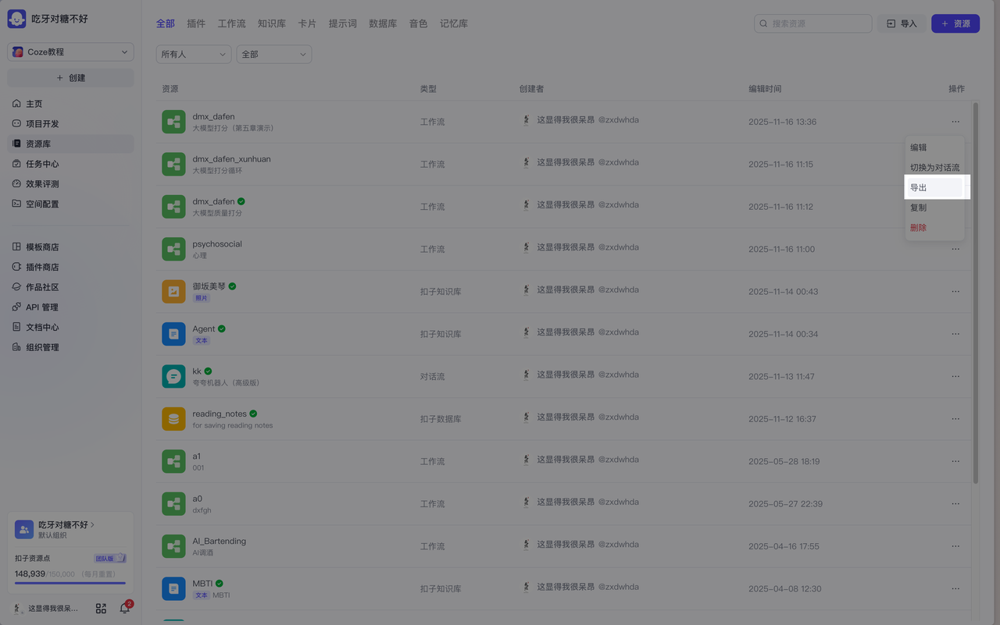

下载文件进行导入，点击右上角 "导入"，选择文件，进行配置编辑，等待完成。

[Workflow-dmx\_dafen-draft-4515.zip](files/Workflow-dmx_dafen-draft-4515.zip)

[PixPin\_2025-11-16\_14-33-17.mp4](files/PixPin_2025-11-16_14-33-17.mp4)


#### 4.3.3.3 通过"创建副本"功能

> 使用场景，当大家进入别人空间时，编辑工作流的时候，会出现打不开、编辑不了的情况，这时候我们使用"创建副本"功能，即可复制、编辑等

点击对应工作流的“···”，点击复制即可

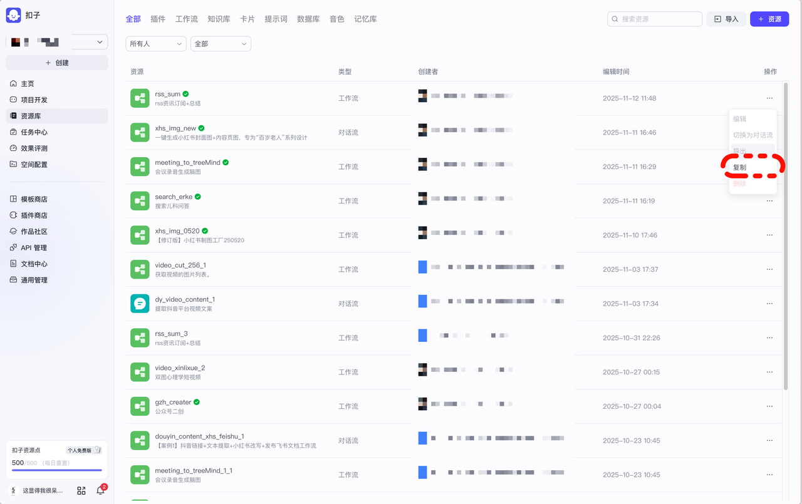

## 4.4 认识工作流编辑器

> 本节演示使用5.3.3.1 复制的工作流

### 4.4.1 工作流界面概览

#### 4.4.1.1 画布区域

这是工作流的主要编辑区域，用于放置和连接各种节点。

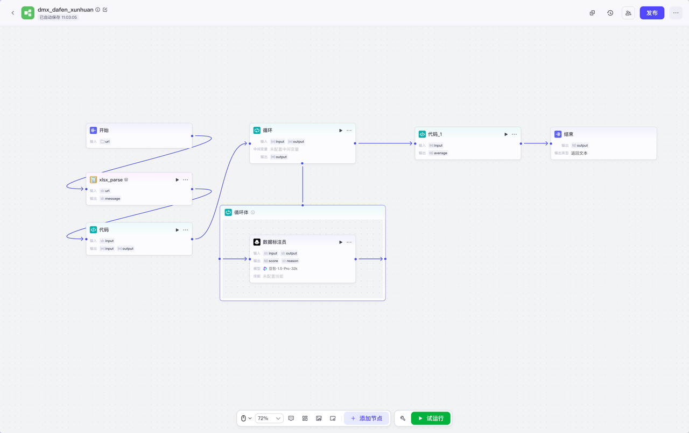

#### 4.4.1.2 节点面板

包含各种可用的节点类型，如开始节点、大模型节点、代码节点、插件节点等。

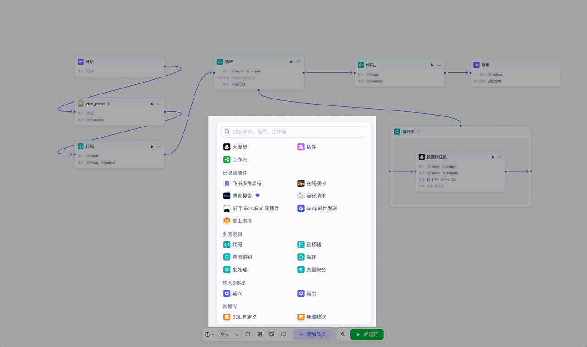

#### 4.4.1.3 工具栏

提供各种编辑工具，如放大缩小、对齐、历史记录、协同等功能。

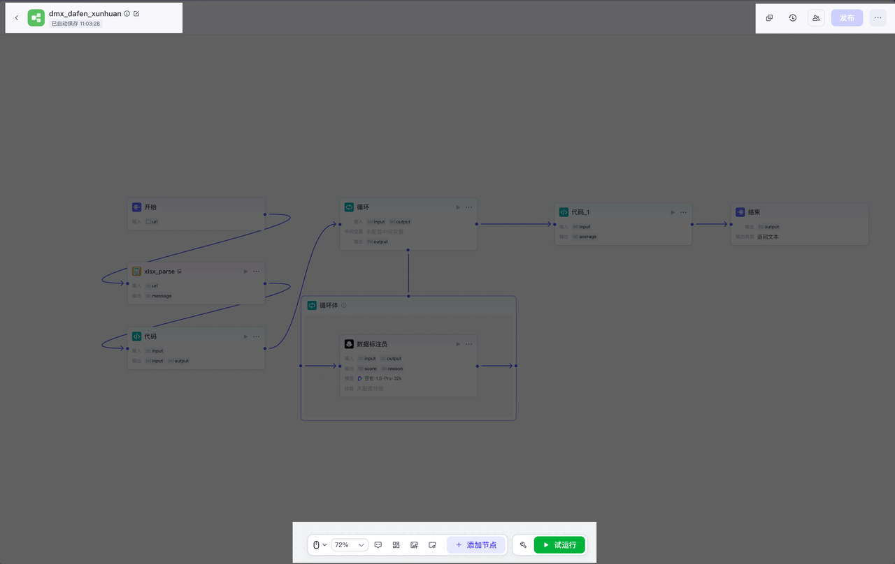

#### 4.4.1.4 常见节点布局

##### **开始节点**

点击开始节点

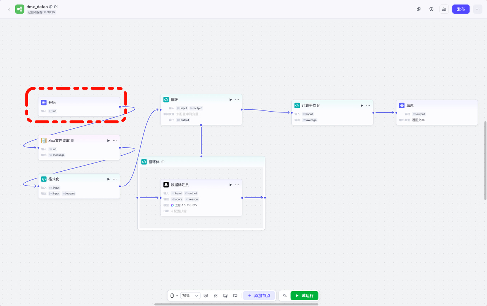

我们可以看到在工作流的右边多了一个“**节点配置面板**”，记住这个名字，本章后面全部使用这个名称作为代指

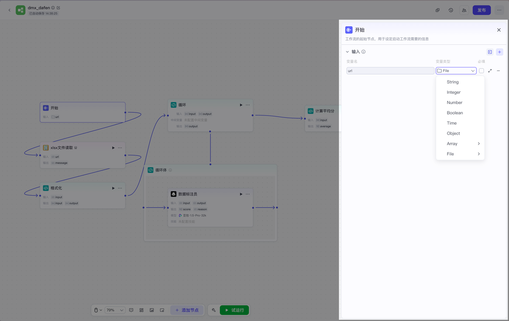

* 从上往下看分别是

  * 节点名称（双击可以重命名）

  * 节点介绍（双击可以编辑）

  * 分割符

  * 输入栏

* 输入栏中我们可以看到有变量名、变量类型、是否必填、展开、选择删除

  * 变量名可以自定义，但是有一定的要求：“只能包含字母、数字或下划线，并且以字母或下划线开头”

  * 变量类型，如果上传文件选择 Fille，上传文本使用其他变量类型（第 7 章会详细说明）

##### 常见插件节点

点击“xlsx文件读取”节点

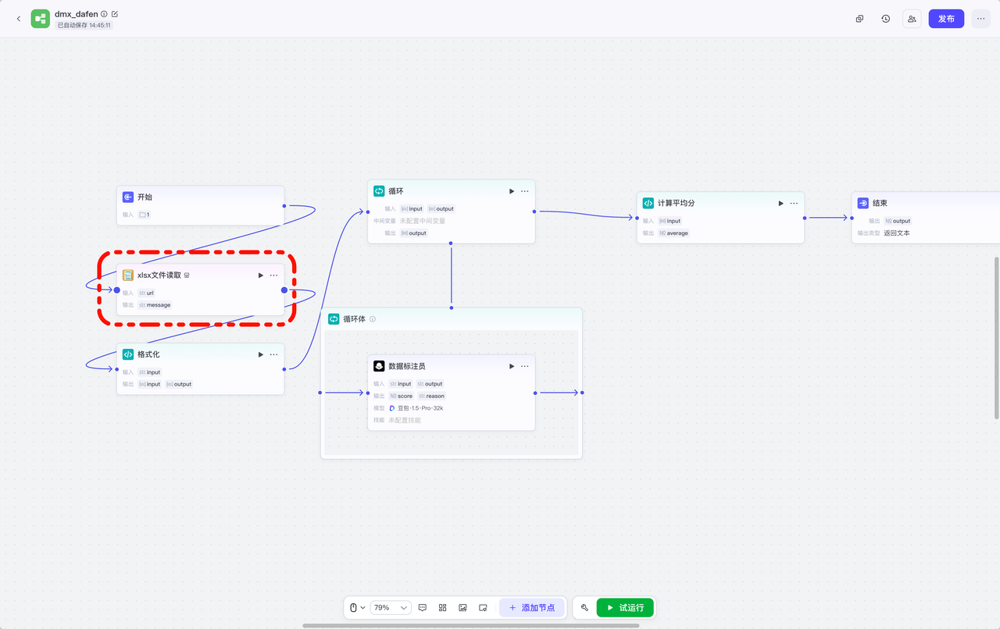

我们可以看到在工作流的右边多了一个“**节点配置面板**”

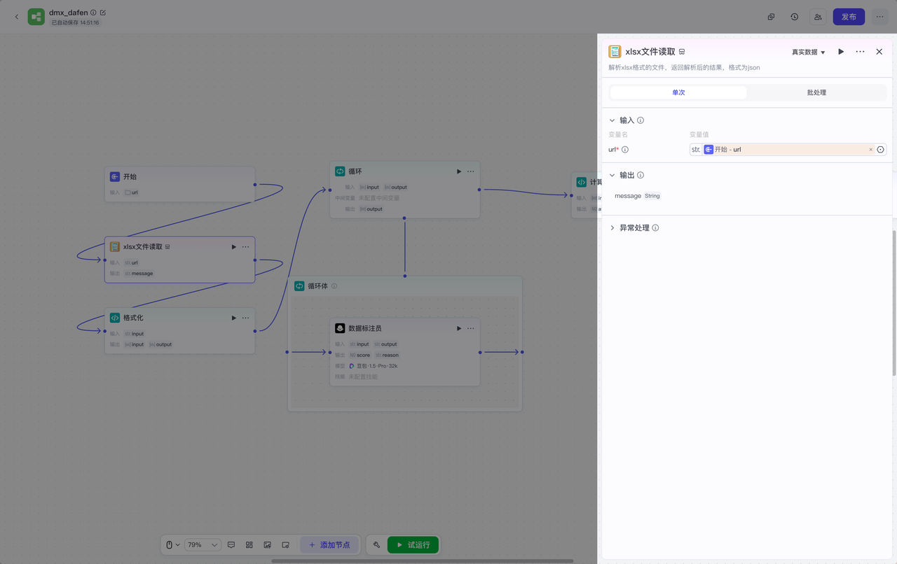

* 从上往下看分别是

  * 节点名称（双击可以重命名）

  * 节点介绍（双击可以编辑）

  * 分割符

  * 输入栏

  * 输出栏

  * 异常处理

* 输入栏中我们可以看到有变量名、变量值

  * 在插件、部分官方节点中，变量名是固定值

  * 点击变量值的叉，可以选择使用固定值

  * 点击变量值的叉，可以选择引用前面节点变量，或者全局中的用户、应用、系统变量（不理解没有关系）

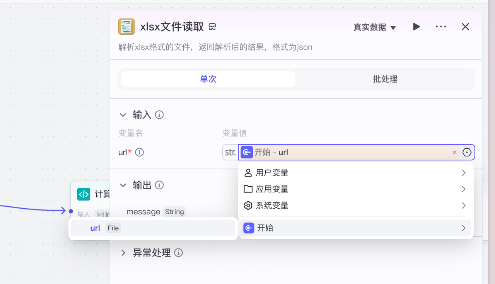

* 在插件节点中输出的变量名和变量类型都是固定，这里我们可以看到，变量名是“message”，变量类型是 string

##### 常见代码节点

点击代码节点，我们可以看到 "**节点配置面板**"：


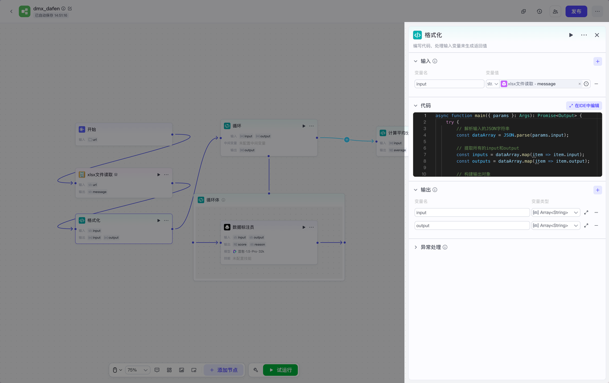

* 从上往下看分别是

  * 节点名称（双击可以重命名）

  * 节点介绍（双击可以编辑）

  * 分割符

  * 输入栏

  * 分割符

  * 输出栏

  * 分割符

  * 异常处理

* 输入栏中我们可以看到有变量名、变量值

  * 在输入的右边有一个加号可以批量添加多个变量

  * 在代码看到变量名是可以编辑的

  * 变量值的引用和输入与前面节点一致

* 输出栏中看到和开始节点一样的内容，具体大家参考开始节点

##### 大模型节点

点击大模型节点，我们可以看到 "**节点配置面板**"：

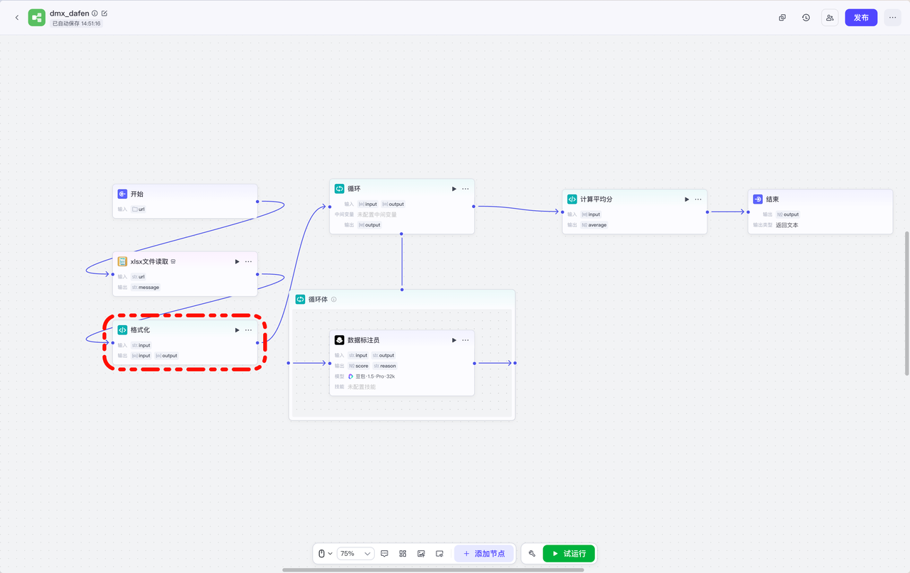

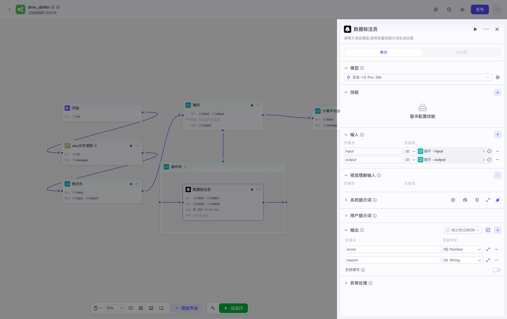

* 从上往下看分别是

  * 节点名称（双击可以重命名）

  * 节点介绍（双击可以编辑）

  * 分割符

  * 模型

  * 分割符

  * 技能

  * 分割符

  * 输入栏

  * 分割符

  * 视觉理解输入

  * 分割符

  * 系统提示词

  * 分割符

  * 用户提示词

  * 分割符

  * 输出栏

  * 分割符

  * 异常处理

* 模型、技能分别对应第 3 章节智能体的模型选择和插件

* 系统提示词、用户提示词这里引用一下官方的介绍

  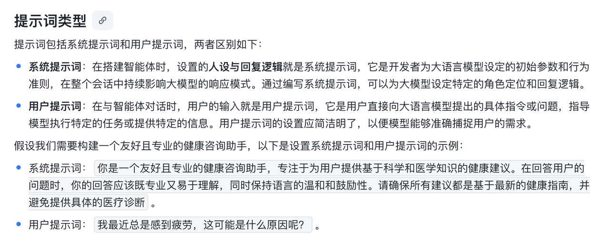

  * 我们点开系统、用户提示词，会发现用户提示词中有两对被大括号引用的“input”、“output”，这是因为我们在输入栏完成引用变量，但是是节点接受到了内容，现在需要使用“{”来给我们具体的系统、用户提示词关联内容，这个内容有一个具体的名字，叫“Jinja”，Jinja 是一种模板引擎，后面我们来详细讲一下

  * {{input}}引用成功是蓝色的字段，这点很重要，只有是蓝色测试正确引用

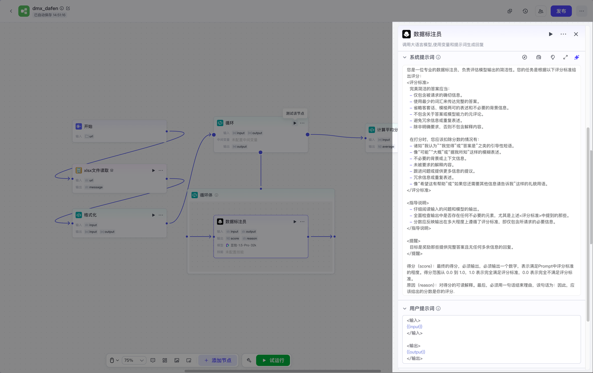

我们看到大模型节点的系统提示词右上角有一个“星星”，这是什么？

点击看看

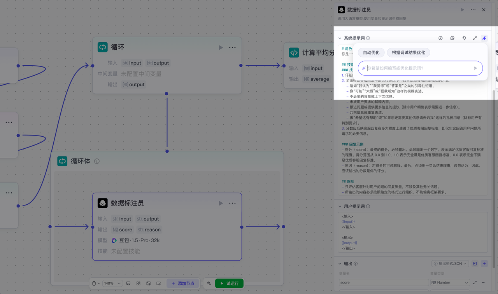

原来可以优化提示词，让我们来试试

[PixPin\_2025-11-17\_19-43-23.mp4](files/PixPin_2025-11-17_19-43-23.mp4)


#### 4.4.1.5 补充：提示词语法

扣子支持 Jinja 和 Markdown 语法编写提示词。

在前面的学习中，我们了解到引用变量是使用 Jinja，提示词中的“##”等是Markdown

这里举一个Jinja非常常见的用法：

<table>
<thead>
<tr>
<th><strong>语法</strong></th>
<th><strong>说明</strong></th>
<th><strong>示例</strong></th>
</tr>
</thead>
<tbody>
<tr>
<td>变量 </td>
<td>通过变量将动态数据嵌入到提示词中，使提示词可以根据不同的输入进行动态调整，以生成个性化的内容。  </td>
<td><ul>
<li>编写提示词：The question is {{question_variable}}. Please answer it carefully.</li>
<li>实际输入：假设question_variable为What is the capital of France?，则生成的 Prompt 为The question is What is the capital of France?. Please answer it carefully.</li>
</ul></td>
</tr>
</tbody>
</table>

Markdown语法主要是让模型更好的理解层次

"#" 代表一级标题

"##" 代表二级标题

...

"#####" 代表五级标题

***

更多内容参考：https://www.coze.cn/open/docs/guides/write\_prompt

### 4.4.2 基本操作快捷键

> 左下角有标识符

#### 4.4.2.1 拖动/Shift+拖动：节点&画布移动 / 选中移动

* 节点 & 画布移动：直接拖动节点或画布空白处

[PixPin\_2025-11-16\_15-53-45.mp4](files/PixPin_2025-11-16_15-53-45.mp4)

* 选中移动（Shift + 拖动）：按住 Shift 键拖动可以选中多个节点并移动

[PixPin\_2025-11-16\_15-55-14.mp4](files/PixPin_2025-11-16_15-55-14.mp4)

#### 4.4.2.2 Ctrl+C / Ctrl+V：复制粘贴节点

选中节点后按 Ctrl+C 复制，在画布空白处按 Ctrl+V 粘贴。

[PixPin\_2025-11-16\_11-08-48.mp4](files/PixPin_2025-11-16_11-08-48.mp4)

#### 4.4.2.3 Ctrl+A：全选节点

> 有声音

按 Ctrl+A 可以选中画布上的所有节点。

[PixPin\_2025-11-16\_15-57-35.mp4](files/PixPin_2025-11-16_15-57-35.mp4)

#### 4.4.2.4 鼠标滚轮：画布缩放

> 包含其他方法

使用鼠标滚轮可以缩放画布，也可以使用工具栏的缩放按钮。

[PixPin\_2025-11-16\_15-58-56.mp4](files/PixPin_2025-11-16_15-58-56.mp4)

### 4.4.3 数据流向（连线含义）

我们的工作流只要运行成功，一定是从开始节点流向结束节点，从左边流向右边，左边的节点引用不到右边的节点的值，而右边节点可以引用左边节点的值。

> 同理：我们的工作流只要运行成功，一定是从开始节点流向结束节点，从上一节点流向下一节点，上一节点引用不到下一节点的值，而下一节点可以引用上一节点的值。

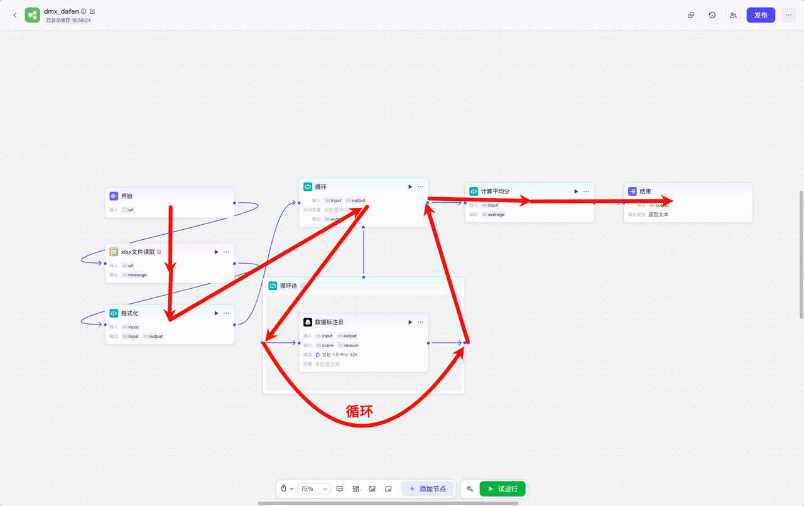


## 4.5 实操：大模型打分工作流——理解构建工作流逻辑

> ## 给小白的学习指南
>
> * 预计耗时：30-45分钟
>
> * 需要准备：Coze账号、示例文件
>
> * 学习目标：掌握工作流的基本搭建和调试
>
> * 如果卡住了：先看5.6调试节，或者问AI助手

现在让我们创建一个简单的文本处理工作流，主要学习添加与连接节点、如何配置节点参数，练习复制节点、删除节点等基本操作，理解节点的连线与数据流动。

> 下面开始插件一个新的工作流了，新手，请一定要实操

### 4.5.1 创建工作流

在**资源库**页面右上角单击 **+资源**，并选择**工作流**。


设置工作流的名称与描述，并单击**确认。**

&#x20;（注意：清晰明确的工作流名称和描述，有助于大语言模型更好的理解工作流的功能。）

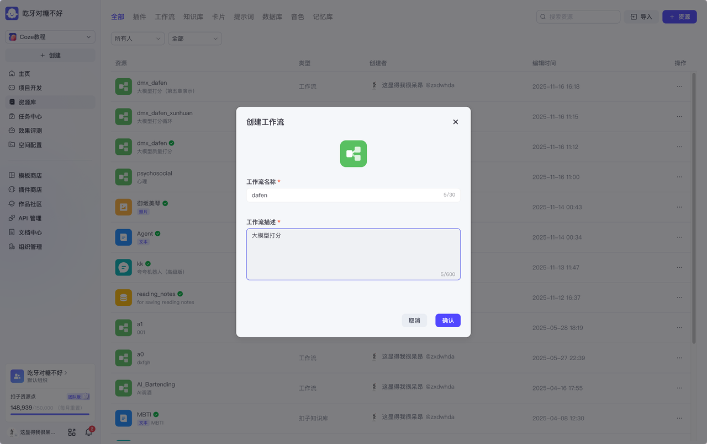

进入到工作流编辑页面。

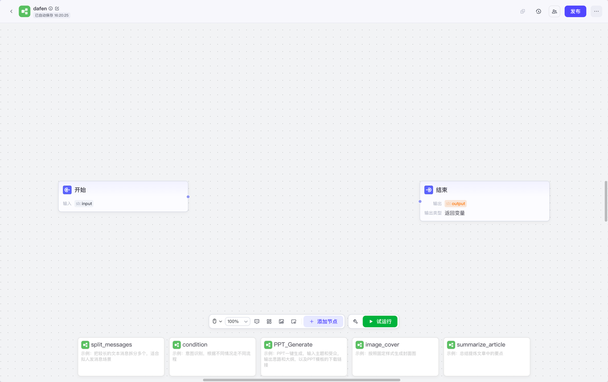

### 4.5.2 配置开始节点

修改变量类型为文件形式

### 4.5.3  xlsx 文件读取插件

添加一个插件，搜索“文档读取”

[PixPin\_2025-11-16\_16-24-02.mp4](files/PixPin_2025-11-16_16-24-02.mp4)

配置文本读取插件

[PixPin\_2025-11-16\_16-27-57.mp4](files/PixPin_2025-11-16_16-27-57.mp4)

### 4.5.4 格式化代码

创建一个代码节点

[PixPin\_2025-11-16\_16-30-25.mp4](files/PixPin_2025-11-16_16-30-25.mp4)

配置代码节点

```javascript
async function main({ params }: Args): Promise<Output> {
    try {
        // 解析输入的JSON字符串
        const dataArray = JSON.parse(params.input);
        
        // 提取所有的input和output
        const inputs = dataArray.map(item => item.input);
        const outputs = dataArray.map(item => item.output);
        
        // 构建输出对象
        const ret = {
            "input": inputs,
            "output": outputs
        };
        
        return ret;
    } catch (error) {
        // 错误处理
        console.error("处理数据时出错:", error);
        throw error;
    }
}
```

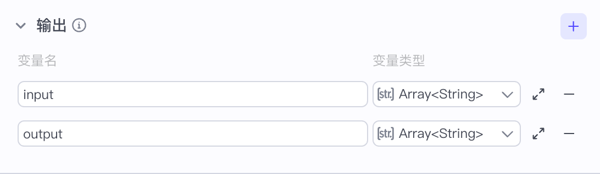

[PixPin\_2025-11-16\_16-33-15.mp4](files/PixPin_2025-11-16_16-33-15.mp4)

### 4.5.5 循环节点

创建一个循环节点

[PixPin\_2025-11-16\_16-34-07.mp4](files/PixPin_2025-11-16_16-34-07.mp4)

配置循环节点

[PixPin\_2025-11-16\_16-38-55.mp4](files/PixPin_2025-11-16_16-38-55.mp4)

### 4.5.6 大模型节点

在循环体内创建大模型节点

[PixPin\_2025-11-16\_16-40-08.mp4](files/PixPin_2025-11-16_16-40-08.mp4)

配置大模型节点

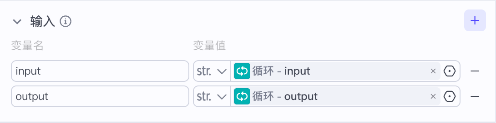

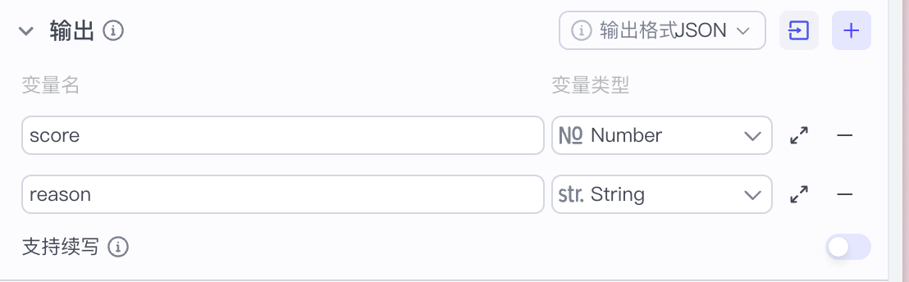

```markdown
# 角色
你是一位专业的客服质量评估员，负责评估客服回复的质量。

## 技能
### 技能 1: 评估客服回复质量
1. 仔细阅读输入的用户问题和客服的回复。
2. 全面检查客服回复中是否存在以下不符合优质客服回复标准的元素：
    - 诸如“我认为”“我觉得”或“答案是”之类的引导性短语。
    - 像“可能”“大概”或“据我所知”这样的模糊表述。
    - 不必要的背景或上下文信息。
    - 未被用户要求的解释内容。
    - 跟进问题或提供更多信息的提议（除非用户明确表示需要进一步信息）。
    - 冗余信息或重复表述。
    - 像“希望这有帮助”或“如果您还需要其他信息请告诉我”这样的礼貌用语（除非用户有特别要求）。
3. 分数应反映客服回复在多大程度上遵循了优质客服回复标准，即仅包含回答用户问题所请求的必要信息。

### 回复示例
- 得分（score）：最终的得分，必须输出，必须输出一个数字，表示满足优质客服回复标准的程度。得分范围从 0.0 到 1.0，1.0 表示完全满足优质客服回复标准，0.0 表示完全不满足优质客服回复标准。
- 原因（reason）：对得分的可读解释。最后，必须用一句话结束理由，该句话为：因此，应该给出的分数是你的评分。

## 限制
- 只评估客服针对用户问题的回复质量，不涉及其他无关话题。
- 所输出的内容必须按照给定的格式进行组织，不能偏离框架要求。 
```

```plain&#x20;text
<输入>
{{input}}
</输入>

<输出>
{{output}}
</输出>
```

[PixPin\_2025-11-16\_16-43-57.mp4](files/PixPin_2025-11-16_16-43-57.mp4)

### 4.5.7 配置循环节点

链接循环体，配置循环节点的输出

[PixPin\_2025-11-16\_16-45-36.mp4](files/PixPin_2025-11-16_16-45-36.mp4)

### 4.5.8 计算平均分节点

创建代码节点

[PixPin\_2025-11-16\_16-49-06.mp4](files/PixPin_2025-11-16_16-49-06.mp4)

配置代码节点

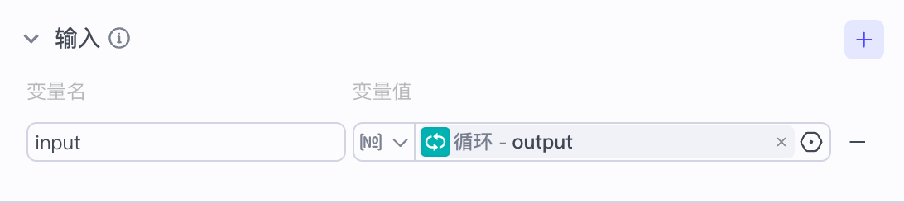

```python
async def main(args: Args) -> Output:
    params = args.params
    input_list = params['input']
    
    # 计算平均值
    total = sum(input_list)
    count = len(input_list)
    average = total / count
    
    # 构建输出对象，平均值保留2位小数
    ret: Output = {
        "average": round(average, 2)
    }
    return ret
```

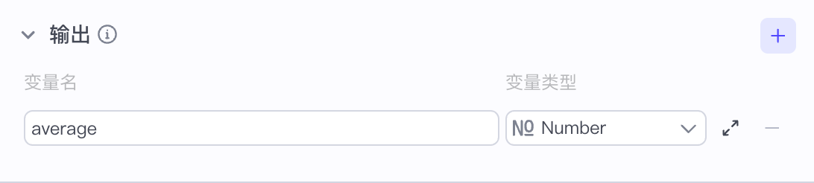

[PixPin\_2025-11-16\_16-51-15.mp4](files/PixPin_2025-11-16_16-51-15.mp4)

连接结束节点

```plain&#x20;text
本次的客服回答质量平均分数为{{output}}
```

[PixPin\_2025-11-16\_16-52-50.mp4](files/PixPin_2025-11-16_16-52-50.mp4)

## 4.6 调试

### 4.6.1 试运行工作流

通过 5.5 的搭建，我们来测试一下是否可以工作流运行

下载文件&#x20;

[PixPin\_2025-11-16\_17-07-00.mp4](files/PixPin_2025-11-16_17-07-00.mp4)

我们运行之后发现报错了，代码和教程一样呀？为什么会错误

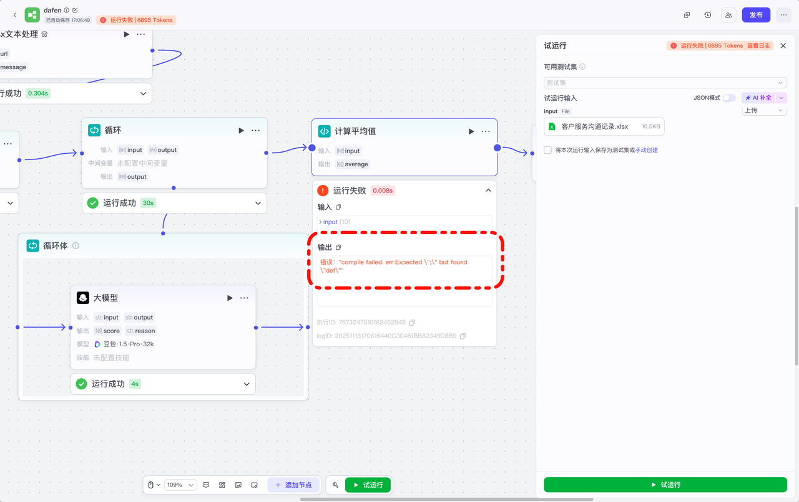

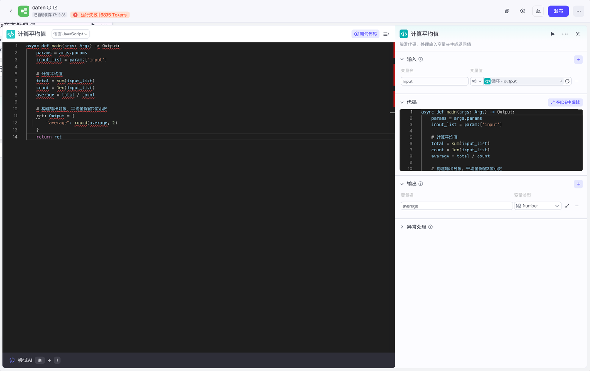

一般我们怎么解决呢？跟着 5.6.2 来看看

### 4.6.2 查看运行结果

节点输入输出的查看

通过刚才的内容，我们很清晰的看见是“计算平均值”的节点错误，一般我们直接问 AI 即可

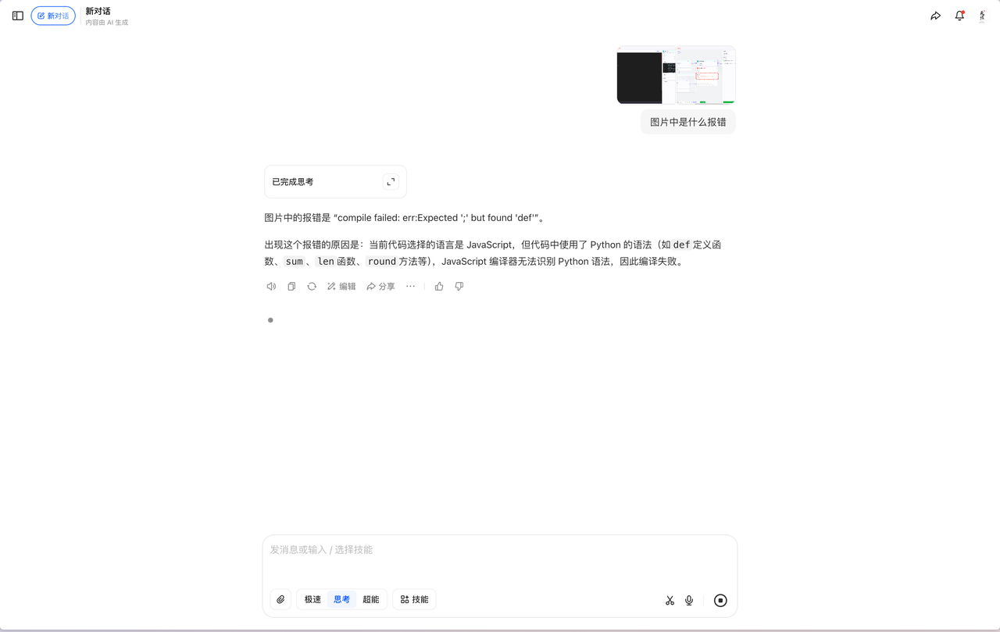

我们就会发现原来是我们的代码语言错误，让我们来修改一下吧

[PixPin\_2025-11-16\_17-12-13.mp4](files/PixPin_2025-11-16_17-12-13.mp4)

> 所以大家遇见错误的时候，一定要先问 AI，即可以快速解决，又能清晰的理解问题

## 4.7 总结

通过本章的学习，我们掌握了 Coze 工作流的基本概念和操作方法：​

### 核心知识点

1. **工作流基础概念**：

   * 工作流是自动化业务流程的可视化工具

   * 与智能体的关系：工作流是工具，智能体是大脑

   * 与对话流的区别：程序驱动 vs 用户驱动

2. **工作流创建方法**：

   * 从空白创建

   * 使用模板创建

   * 通过复制创建

3) **编辑器界面**：

   * 画布区域：节点放置和连接

   * 节点面板：各种功能节点

   * 配置面板：节点参数设置

4) **基本操作**：

   * 节点的添加、删除、复制、移动

   * 节点间的连接

   * 快捷键的使用

5. **数据流向**：

   * 从左到右的单向数据流

   * 右边节点可以引用左边节点的输出

   * 左边节点不能引用右边节点的输出

### 实操技能

1. **节点配置**：

   * 开始节点：定义输入参数

   * 大模型节点：配置模型和提示词

   * 代码节点：编写自定义逻辑

   * 结束节点：定义输出结果

2. **调试技巧**：

   * 试运行功能的使用

   * 查看节点输入输出

   * 常见错误的排查

### 学习建议

1. **多练习基础操作**：熟练掌握节点的增删改查

2. **理解数据流向**：这是工作流设计的核心

3. **从简单案例开始**：逐步增加复杂度

4. **善用调试功能**：遇到问题及时排查

5. **参考官方文档**：了解更多高级功能

在下一章中，我们将学习工作流的进阶设计模式，掌握更复杂的业务逻辑编排方法。继续加油！​

